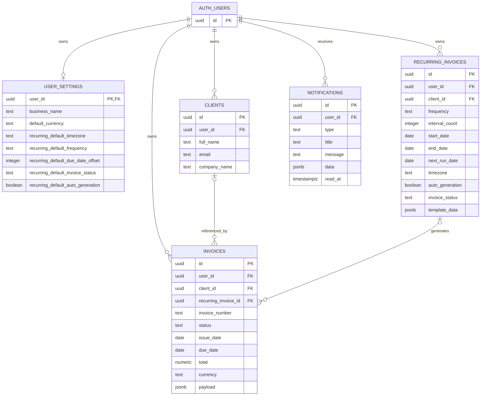

# 2. Database Schema and ERD

## 2.1 Database ownership

The application database is Supabase PostgreSQL. The SQL migration history is:

1. `001_invoices.sql`
2. `002_clients.sql`
3. `003_settings.sql`
4. `004_subscriptions.sql` (legacy subscription schema)
5. `005_repair_application_schema.sql`
6. `006_recurring_invoices.sql`
7. `007_recurring_preferences_notifications.sql`
8. `008_invoice_lifecycle.sql`
9. `009_invoice_child_rls_hardening.sql`
10. `010_billing_architecture.sql` (legacy billing schema)
11. `011_invoice_presentation.sql`
12. `012_invoice_share_tokens.sql`
13. `013_settings_schema_repair.sql`
14. `014_invoice_status_persistence.sql`
15. `015_private_beta_settings.sql`
16. `016_onboarding_feedback.sql`
17. `017_settings_billing_completion.sql` (legacy billing schema)
18. `018_billing_idempotency.sql` (legacy billing schema)
19. `019_free_platform_cleanup.sql`

Migration `007` was previously verified against live Supabase. Migration `019` is a forward cleanup migration that removes the legacy subscription and billing objects from that project and reloads PostgREST. It must be applied through the Supabase project migration mechanism before production use.

## 2.2 Entity relationship diagram

`AUTH_USERS` is Supabase-managed `auth.users`, not an application-created public table.

## 2.3 `auth.users`

**Purpose:** Supabase-managed identity, credentials, email verification, metadata, and sessions.

**Application dependency:**

- Every application-owned user-scoped table references `auth.users(id)`.
- Foreign keys use `on delete cascade`.
- The application reads the authenticated user through Supabase Auth.
- The server validates access tokens with `auth.getUser`.

The complete internal Supabase Auth schema is provider-owned and is not reproduced here.

## 2.4 `public.invoices`

**Purpose:** Persisted invoices and their searchable summary fields.

| Column | Type | Key/default/constraint |
|---|---|---|
| `id` | `uuid` | PK, `gen_random_uuid()` |
| `user_id` | `uuid` | FK to `auth.users(id)`, required, cascade delete |
| `invoice_number` | `text` | Required; unique with `user_id` |
| `status` | `text` | Required; `Draft`, `Sent`, `Paid`, `Overdue`, or `Cancelled` |
| `issue_date` | `date` | Required |
| `due_date` | `date` | Nullable |
| `client` | `text` | Required, default empty |
| `company` | `text` | Required, default empty |
| `total` | `numeric(14,2)` | Required, default `0` |
| `currency` | `text` | Required, default `USD` |
| `payload` | `jsonb` | Required, default `{}` |
| `created_at` | `timestamptz` | Required UTC default |
| `updated_at` | `timestamptz` | Required UTC default; trigger-maintained |
| `client_id` | `uuid` | FK to `clients(id)`, nullable, `on delete set null` |
| `recurring_invoice_id` | `uuid` | FK to `recurring_invoices(id)`, nullable, `on delete set null` |

**Indexes and uniqueness:**

- Unique `(user_id, invoice_number)`
- `(user_id, updated_at desc)`
- `(user_id, status)`
- `(user_id, issue_date desc)`
- `(user_id, client_id)`
- `(recurring_invoice_id)`

**Trigger:** `invoices_updated_at` calls `set_invoice_updated_at()`.

**RLS:**

- Select: `auth.uid() = user_id`
- Insert: `auth.uid() = user_id`
- Update: user-owned rows; current migration uses the ownership predicate
- Delete: `auth.uid() = user_id`

## 2.5 `public.clients`

**Purpose:** Reusable customer/client records.

| Column | Type | Key/default/constraint |
|---|---|---|
| `id` | `uuid` | PK, generated UUID |
| `user_id` | `uuid` | FK to `auth.users(id)`, required, cascade delete |
| `full_name` | `text` | Required |
| `company_name` | `text` | Required, default empty |
| `email` | `text` | Required, default empty |
| `phone` | `text` | Required, default empty |
| `billing_address` | `text` | Required, default empty |
| `city` | `text` | Required, default empty |
| `state` | `text` | Required, default empty |
| `postal_code` | `text` | Required, default empty |
| `country` | `text` | Required, default empty |
| `tax_id` | `text` | Required, default empty |
| `notes` | `text` | Required, default empty |
| `created_at` | `timestamptz` | Required UTC default |
| `updated_at` | `timestamptz` | Required UTC default; trigger-maintained |

**Indexes and uniqueness:**

- Partial unique index `(user_id, lower(email), lower(company_name))` where `email <> ''`
- `(user_id, updated_at desc)`
- `(user_id, lower(full_name))`

**Trigger:** `clients_updated_at` calls `set_client_updated_at()`.

**RLS:** User-owned select, insert, update, and delete policies.

## 2.6 `public.user_settings`

**Purpose:** One row of business, invoice, notification, appearance, and recurring preferences per user.

**Identity and business columns:** `user_id` (PK/FK), `business_name`, `business_logo`, `business_email`, `business_phone`, `website`, `tax_id`, `registration_number`, `address`, `city`, `state`, `postal_code`, `country`.

**Invoice defaults:** `default_currency`, `default_language`, `default_tax_rate`, `default_payment_terms`, `default_due_days`, `invoice_number_format`, `invoice_prefix`, `starting_invoice_number`, `default_notes`, `default_terms`.

**Notification and appearance:** `invoice_sent_emails`, `payment_reminder_emails`, `product_updates`, `security_alerts`, `marketing_emails`, `theme`.

**Recurring defaults added by migration 007:**

- `recurring_default_timezone text not null default 'UTC'`
- `recurring_default_frequency text not null default 'monthly'`
- `recurring_default_due_date_offset integer not null default 14`
- `recurring_default_invoice_status text not null default 'Draft'`
- `recurring_default_auto_generation boolean not null default true`

**Audit columns:** `created_at`, `updated_at`.

**Trigger:** `user_settings_updated_at` calls `set_user_settings_updated_at()`.

**RLS:** User-owned select, insert, and update. Account deletion is performed through the API/Auth flow.

## 2.7 `public.recurring_invoices`

**Purpose:** Scheduled invoice templates and lifecycle state.

The table includes:

- Identity: `id`, `user_id`, `client_id`
- Schedule: `client_name`, `frequency`, `interval_count`, `start_date`, `end_date`, `next_run_date`, `timezone`
- Invoice behavior: `due_date_offset`, `auto_invoice_number`, `auto_generation`, `invoice_status`
- Lifecycle: `status`, `last_generated_at`, `generated_invoice_count`
- Template: `template_data jsonb`
- Audit: `created_at`, `updated_at`

**Constraints:**

- `frequency`: daily, weekly, monthly, quarterly, yearly, or custom
- `status`: active, paused, completed, or cancelled
- `next_run_date >= start_date`
- `auto_generation` defaults true
- `invoice_status`: Draft, Sent, Paid, Overdue, or Cancelled
- Required dates and interval values are additionally validated by the API

**Indexes:**

- `(user_id, status)`
- `(status, next_run_date)`
- `(user_id, next_run_date)`

**Trigger:** `recurring_invoices_updated_at` maintains `updated_at`.

**RLS:** User-owned select, insert, update, and delete.

## 2.9 `public.notifications`

**Purpose:** User-visible in-app events, currently including generated recurring invoice notifications.

| Column | Type | Constraint |
|---|---|---|
| `id` | `uuid` | PK, generated UUID |
| `user_id` | `uuid` | FK to `auth.users(id)`, cascade delete |
| `type` | `text` | Required |
| `title` | `text` | Required |
| `message` | `text` | Required |
| `data` | `jsonb` | Required, default `{}` |
| `read_at` | `timestamptz` | Nullable |
| `created_at` | `timestamptz` | Required UTC default |

**Index:** `(user_id, created_at desc)`.

**RLS:** User-owned select and update. Inserts are performed by the trusted server-side generator.

## 2.10 Storage

The server exposes avatar upload through `src/lib/storage.ts`. Supabase Storage objects and any bucket policies are provider-managed and are not represented as application tables in the SQL migration set. The exact bucket policy should be audited in the Supabase dashboard as part of deployment governance.